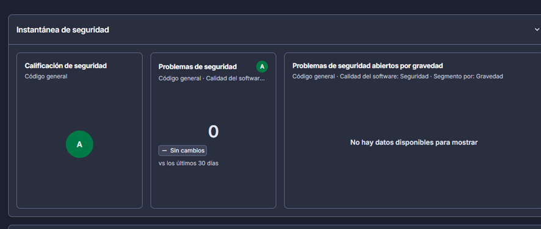
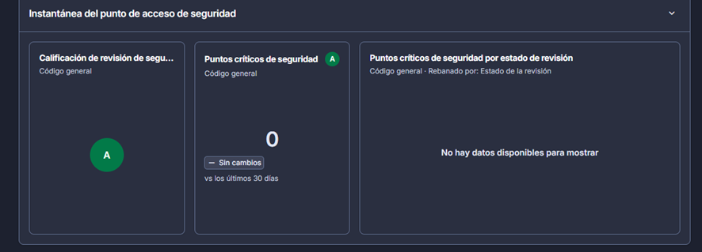
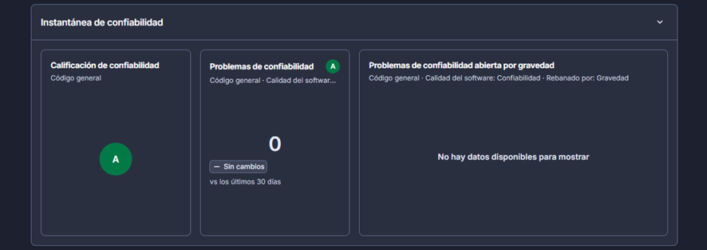
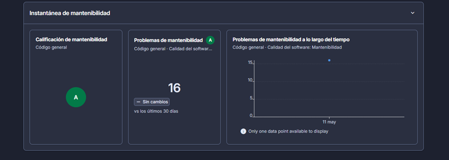

Breve descripción: Instantánea de **Seguridad** con calificación **A** (la mejor, en una escala típica A–E) y **0** problemas detectados.

Esto indica que, según el análisis de SonarCloud, no se encontraron vulnerabilidades en el código en ese momento. Además, como el conteo es **0**, el panel por gravedad no muestra detalle porque no hay elementos para clasificar.

Breve descripción: Instantánea de **Security Hotspots** con calificación **A** y **0** puntos críticos.

Los *hotspots* no son “vulnerabilidades confirmadas”; son zonas del código que SonarCloud marca como **sensibles** y que normalmente requieren **revisión manual** (por ejemplo, validaciones, permisos, manejo de datos). Aquí aparece **0**, por lo que no hay nada pendiente de revisar.

Breve descripción: Instantánea de **Confiabilidad** con calificación **A** y **0** problemas.

La confiabilidad está relacionada con “bugs” que podrían causar fallos en ejecución. Al mostrar **0**, significa que no se detectaron problemas de confiabilidad y por eso tampoco aparece un desglose por severidad.

Breve descripción: Instantánea de **Mantenibilidad** con calificación **A** y **16** problemas (code smells).

Aquí SonarCloud sí reporta hallazgos: los **code smells** son oportunidades de mejora (legibilidad, duplicación, complejidad, reglas de estilo, etc.). Aun así, la calificación se mantiene en **A**, lo que sugiere que el nivel de deuda/mantenibilidad general sigue siendo aceptable.
